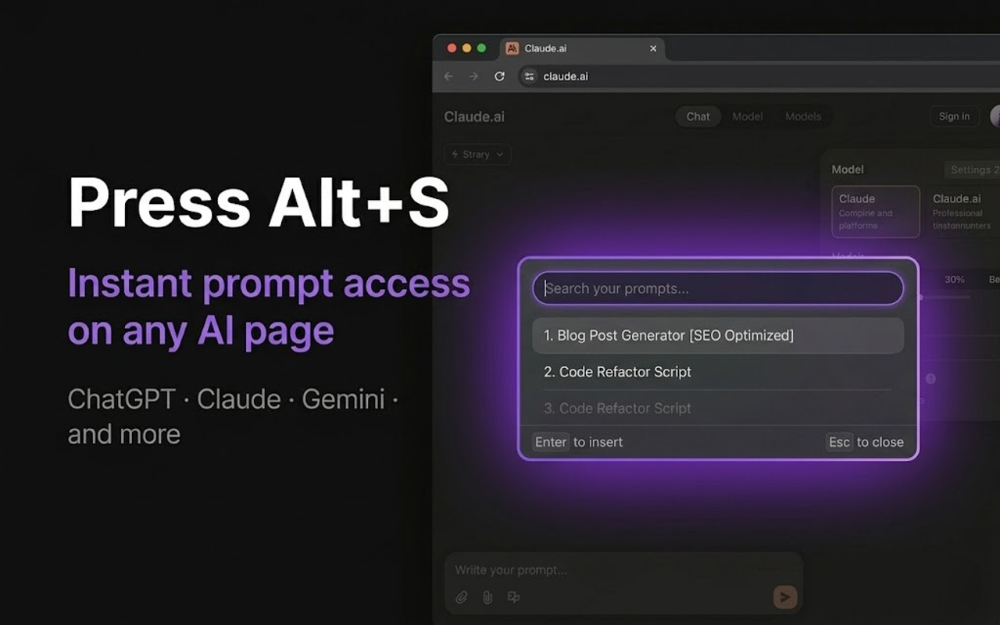
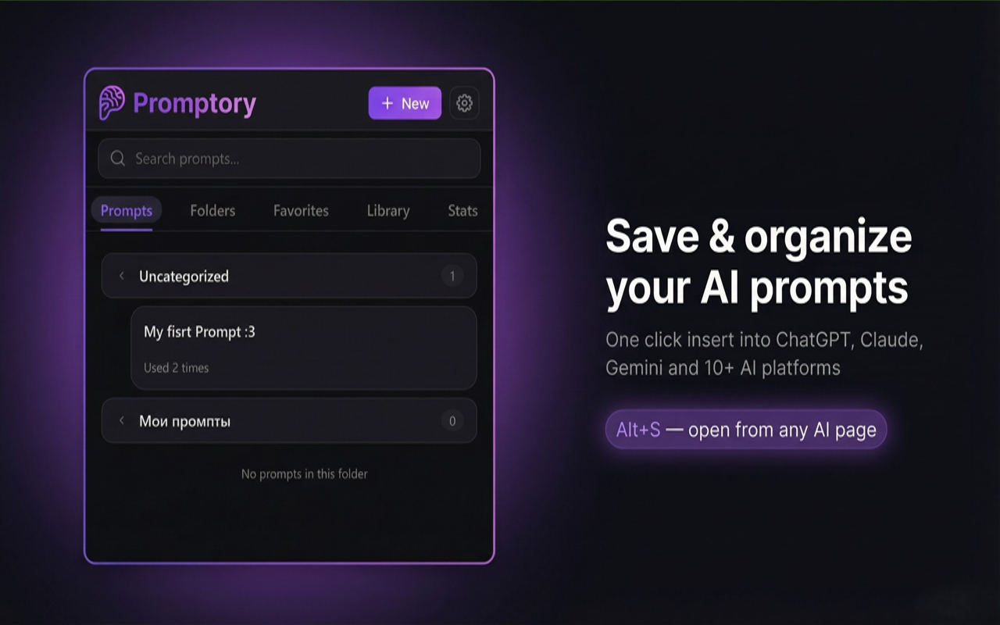
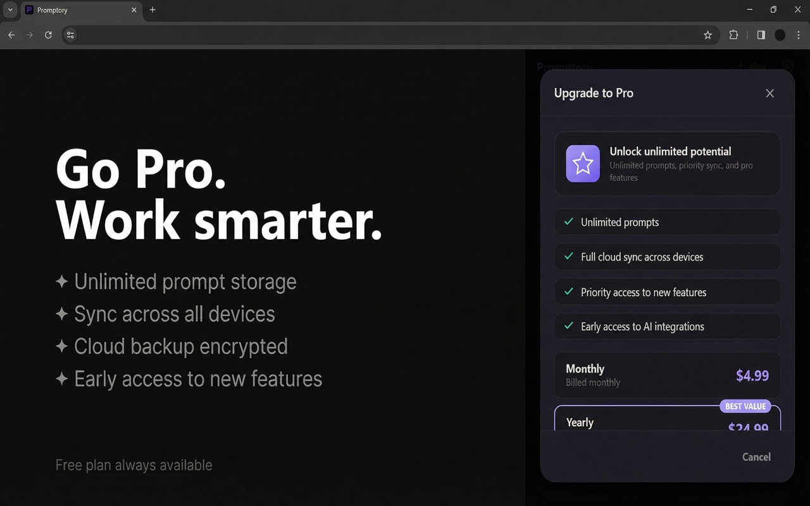
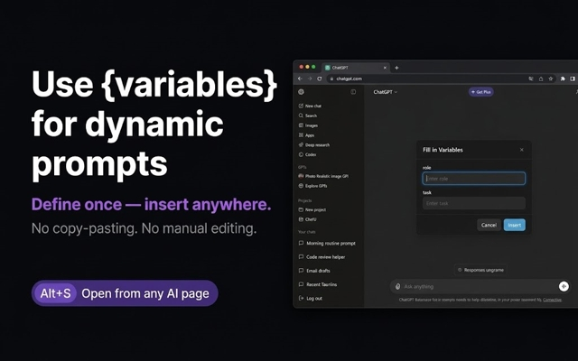

<div align="center">


# Promtly

**AI Prompt Improver & Image Analyzer — Free Chrome Extension for ChatGPT, Claude, Gemini & Stable Diffusion**

[](https://chromewebstore.google.com/detail/promptory/enmooiddeabgnpkkcohphpicijjeogfo?pli=1)
[](LICENSE)
[](https://reactjs.org/)
[](https://www.typescriptlang.org/)
[](https://github.com/Leks2000/Promtly)

[**→ Install Promtly for Chrome**](https://chromewebstore.google.com/detail/promptory/enmooiddeabgnpkkcohphpicijjeogfo?pli=1) · [Report a Bug](https://github.com/Leks2000/Promptory/issues) · [Request a Feature](https://github.com/Leks2000/Promptory/issues)

</div>

---

## What is Promtly?

**Promtly** is a free, open-source Chrome extension that automatically improves your AI prompts — turning rough ideas into precise, high-quality instructions that actually get results.

Whether you're generating images in Stable Diffusion, writing with ChatGPT, or building something with Claude — Promtly rewrites your prompt using AI so you don't need prompt engineering experience. Just type what you want, pick a mode, and get a better version in seconds.

**Drop any image** into Promtly and it will generate a ready-to-use prompt for you — perfect for recreating styles in Stable Diffusion or describing visuals for text-based AI models.

> Your prompts are processed through **your own API keys** and stored **locally in your browser**. Nothing goes through our servers.

---
 
## Screenshots
 
| Quick Search Overlay | Prompt Library | Pro Features | Dynamic Variables |
|---|---|---|---|
|  |  |  |  |
 
---
 
## Features
 
### ⚡ Instant Access
- **`Alt+S`** — open prompt search overlay on any AI page
- **`Alt+1` / `Alt+2` / `Alt+3`** — quick-insert your top 3 prompts without even opening the overlay
- **`Enter`** to insert, **`Esc`** to close — keyboard-first workflow
### 📁 Organize Everything
- Save prompts in **folders** with tags and favorites
- **Stats** — see which prompts you use most
- **Community Library** — browse prompts shared by other users
- **Export / Import** as JSON or CSV
### 🔧 Power User Features
- **`{variables}`** — define placeholders that pop up as a form before inserting, so you fill in the dynamic parts without editing the prompt manually
- **Right-click any text** → "Save as Prompt" — capture prompts instantly while browsing
- Works **100% offline** — your prompts never leave your browser unless you opt into sync
### 🔒 Privacy First
- Prompts stored **locally in your browser** by default
- Cloud sync is **optional and encrypted** (Pro)
- No data selling, no tracking
---

## Prompt Library & History

Every improved prompt is automatically saved with full metadata — provider, model, tokens used, and timestamp.

- **Full search** across all saved prompts
- **Tags and categories** for organization
- **Filters** by type, provider, date, or tag
- **Export** to JSON, TXT, or Markdown

### Prompt Sharing

- Generate a **public shareable link** for any prompt
- **Auto-generated QR codes** for mobile sharing
- **One-click share** to Telegram or Twitter/X
- **Embed code** for websites and docs

---

## Supported AI Platforms

Works with every major AI platform — no setup or configuration required.

| Platform | Supported |
|---|---|
| ChatGPT (chatgpt.com) | ✅ |
| Claude (claude.ai) | ✅ |
| Gemini (gemini.google.com) | ✅ |
| Microsoft Copilot | ✅ |
| Stable Diffusion / ComfyUI | ✅ |
| Midjourney | ✅ |
| DALL·E | ✅ |
| Civitai | ✅ |
| Perplexity | ✅ |

---

## Supported API Providers

Promtly uses **your own API keys** — you're never locked into a single provider.

| Provider | Free Tier | Models |
|---|---|---|
| OpenRouter | ✅ Free $5 credits on signup | WizardLM-2, Mixtral, LLaMA 3.1 |
| HuggingFace | ✅ 1000+ free requests/day | Mixtral, DialoGPT |
| Poe | ✅ Free tier available | Claude, GPT-4, Gemini |

---

## Installation

**Option 1 — Chrome Web Store** *(coming soon)*

1. Go to Chrome Web Store → Promtly
2. Click **Add to Chrome**
3. Open any AI platform and start improving prompts

**Option 2 — Manual Install (Developer Mode)**

```bash
git clone https://github.com/Leks2000/Promtly.git
cd Promtly
npm install
npm run build
```

1. Open Chrome → `chrome://extensions/`
2. Enable **Developer mode** (top right)
3. Click **Load unpacked** → select the `dist/` folder
4. Open ChatGPT, Claude, or Gemini and start using Promtly

---

## Privacy

Promtly is built privacy-first:

- ✅ **Your own API keys** — prompts are processed through your provider, not ours
- ✅ **Local storage by default** — all data stays in your browser
- ✅ **No tracking, no analytics, no data selling**
- ✅ **Cloud sync is optional** and requires explicit Google sign-in
- ✅ **Open source** — read every line of the code yourself

---

## Tech Stack

- **React 18** — UI components
- **TypeScript** — type-safe codebase
- **Vite** — fast build tooling
- **Tailwind CSS** — utility-first styling
- **Chrome Extension Manifest V3** — modern extension architecture
- **Google OAuth 2.0** — optional cloud sync authentication

---

## Contributing

Issues, feature requests, and PRs are welcome.

1. Fork the repo
2. Create your branch: `git checkout -b feature/your-feature`
3. Commit your changes: `git commit -m 'Add some feature'`
4. Push to the branch: `git push origin feature/your-feature`
5. Open a Pull Request

---

## License

MIT © [Leks2000](https://github.com/Leks2000)

---

<div align="center">

**[⭐ Star this repo if it helped you](https://github.com/Leks2000/Promtly)**

*Bad prompts = bad results. Fix the prompt, fix the output.*

</div>
